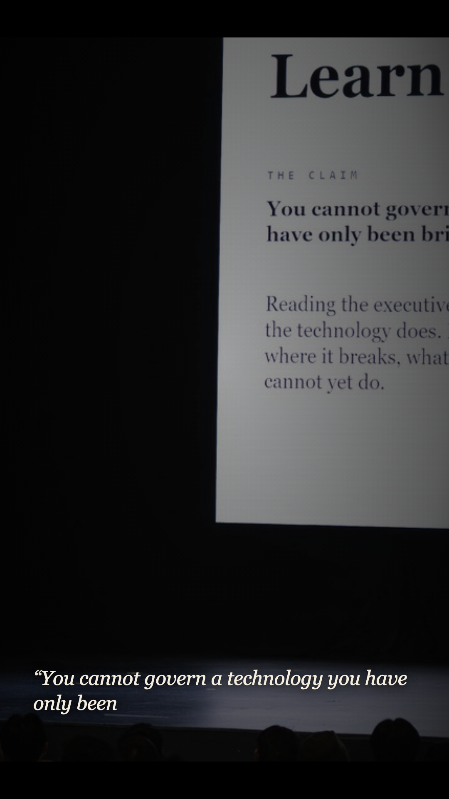
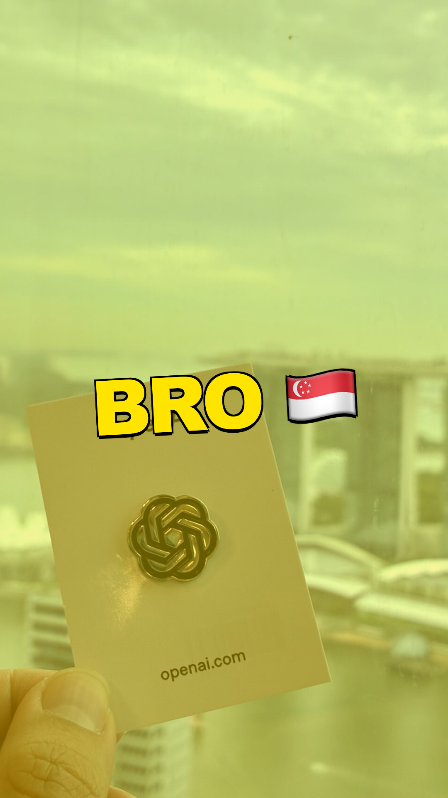
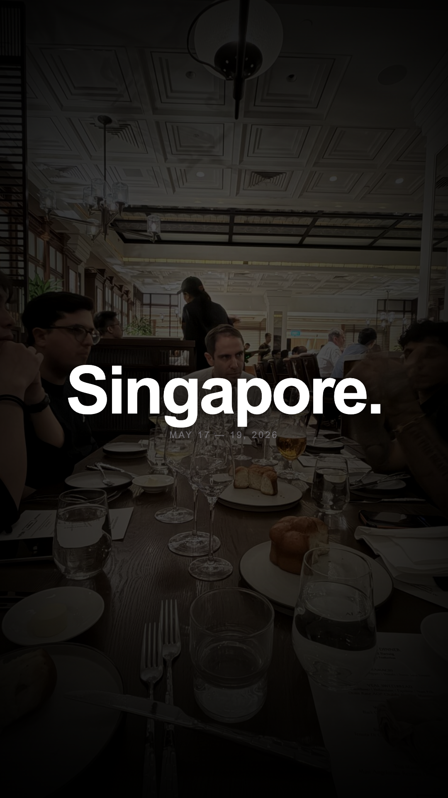
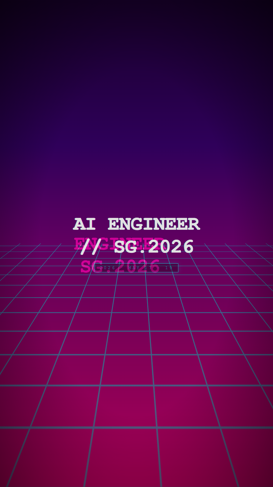
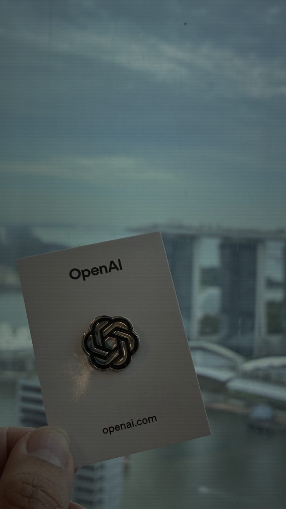
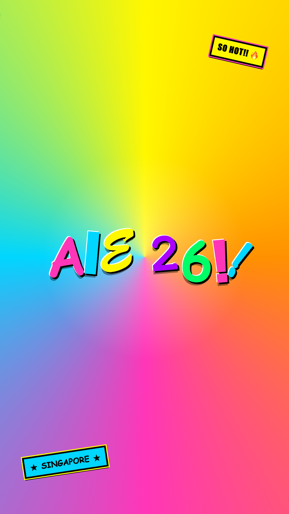
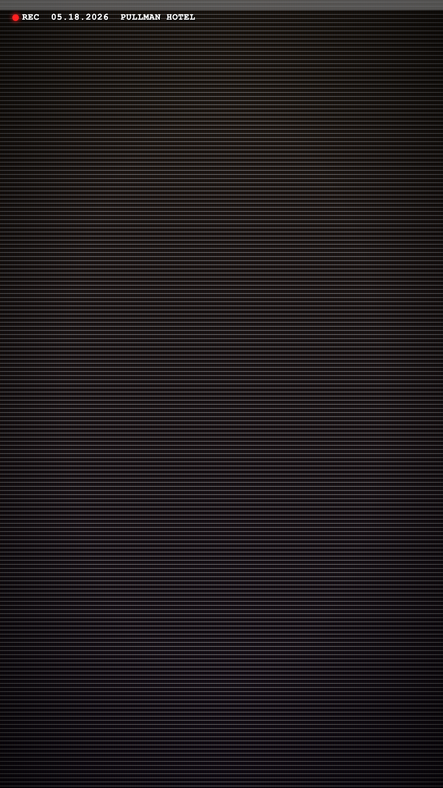
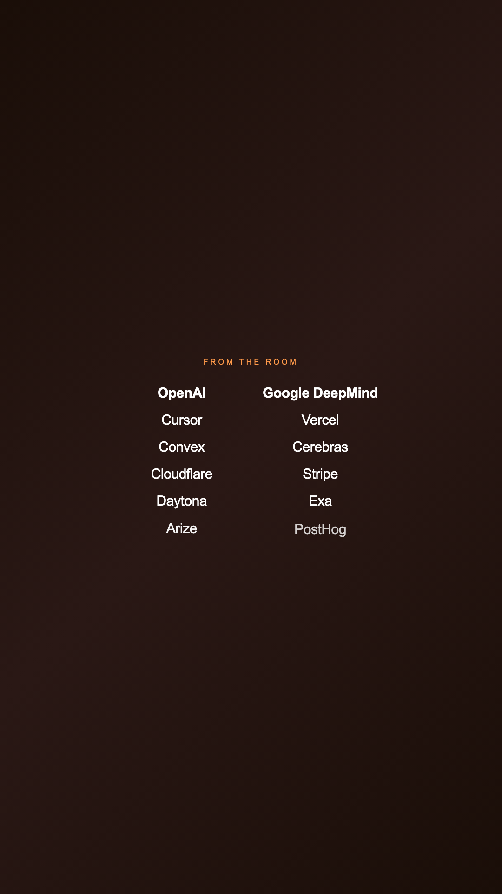
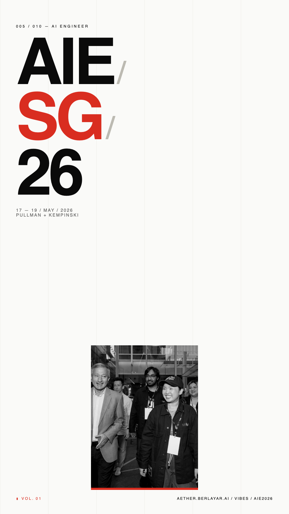
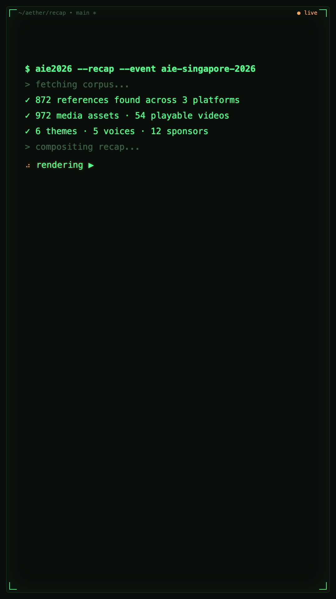

# Recap reel · 10 divergent variations

Ten 12-second AIE-Singapore-2026 recap variants. Each gets its own
3-scene composition built from the same shared `aie2026SampleBundle`
data — only the visual personality changes.

All variants render at **30fps · 12s · 360 frames**. Each has two
compositions registered: vertical (1080×1920) for TikTok/Reels/Shorts
and horizontal (1920×1080) for YouTube/LinkedIn/X video.

Source: `src/remotion/variants/<slug>/Composition.tsx`.
Stills: `docs/mocks/recap-variants/<slug>/{cover,mid,end}.png`.
Renders: `out/variants/<slug>-{9x16,16x9}.mp4` (gitignored).

To render any variant locally:
```bash
npx remotion render src/remotion/index.tsx \
  Variant-<slug>-Vertical out/variants/<slug>-9x16.mp4
```
Or scrub interactively:
```bash
npm run recap:studio
```

---

## Smart-crop + motion (2026-05-26)

**Focal points.** Every `MediaAsset` in `src/remotion/EventRecap/data.ts`
now carries `focal: {x, y}` and `subjectBox: {x, y, w, h}`, populated by
`scripts/tag-media-focal.ts` (OpenAI GPT-5.4 Mini, ~$0.05 for the full
pool). `MediaBackdrop` and per-variant scenes resolve those through
`focalObjectPosition()` to bias `object-position` (and `transformOrigin`
under Ken Burns), so horizontal source photos no longer center-crop
blindly when framed in 9:16 — speakers, sponsor pins, and badges stay
inside the safe area.

**Ken Burns pan.** `defaultKenBurns(asset)` derives a from/to pan from
the subject-box center toward the focal point with a 1.02 → 1.12 zoom.
Wired into four motion-friendly variants: **sundance-doc** (cold-open
drift on faces, scene-local time for each montage pick), **brand-sizzle**
(horizontal-led parallax over Vivian + sponsor wall), **vhs-doc**
(deliberate base motion under the wobble), and **apple-keynote**
(ultra-slow rise with a y bias toward focal). The other six variants
keep static focal-point crops — Ken Burns would fight their character
(mrbeast hyper-cuts, synthwave glitch, etc).

---

## Face-aware crop (2026-05-26)

The focal-point heuristic biased `object-position` but couldn't
guarantee any specific region of the source stayed visible — with
`object-fit: cover` something always gets cut at extreme aspect
mismatches, and a single focal point only moves WHERE it gets cut.
The reviewer caught a 9:16 frame where Vivian's face was still half-
sliced even after the focal fix.

**Constraint, not heuristic.** Every photo now also carries
`sourceDims` + `faces[]` (SAM3-tagged, with MediaPipe as fallback;
see `docs/mocks/face-tagging-compare/README.md`).
`computeFaceAwareTransform(asset, containerAspect)` produces one of:

- `static` — the `object-position` that centers the face union inside
  the cover-scale window. Used when the union fits.
- `pan` — `from`/`to` `object-position` keys scanning across the union.
  Fires for 5 of 16 photos in 9:16 vertical (multi-person panels +
  audience shots that can't fit in a single static crop). All photos
  are static in 16:9 horizontal.
- `letterbox` — fallback to `object-fit: contain` for the rare case
  where pan is forbidden but the union still won't fit.

`MediaBackdrop` and the variant scenes now drive crop via
`useFaceAwareObjectPosition()` (hook), `faceAwareObjectPosition()`
(pure helper for fixed-aspect stickers like Polaroids), and
`faceAwareKenBurns()` (replaces `defaultKenBurns` in motion variants).
The legacy `focalObjectPosition` / `defaultKenBurns` helpers stay
exported as fallbacks for assets with no face tags.

**Tagger choice.** SAM3 local. ~5s/photo on CPU (one-time cost, paid
at tagging time, not at render). 79 face boxes across 16 photos vs
MediaPipe BlazeFace short-range's 9. SAM3 hits Vivian at confidence
0.84; MediaPipe misses him because his portrait is a 5m-distance
shot, outside short-range BlazeFace's training distribution.
Long-term: swap in MediaPipe BlazeFace `full_range` for live re-
tagging during uploads (60ms/photo).

**Verification stills.** Fresh renders of the reviewer-flagged frames
live in `docs/mocks/face-aware-verification/`. Side-by-side compare:

| | Before (focal heuristic) | After (face-aware) |
|---|---|---|
| brand-sizzle 9×16 mid | `recap-variants/brand-sizzle/mid.png` (Vivian a thumbnail in the dark) | `face-aware-verification/Variant-brand-sizzle-Vertical-frame-0180.jpg` (face whole + centered) |
| sundance-doc 9×16 mid | `recap-variants/sundance-doc/mid.png` | `face-aware-verification/Variant-sundance-doc-Vertical-frame-0180.jpg` |

---

## Face-aware text placement (2026-05-26)

**The constraint.** Cropping put the right pixels on screen but wordmarks
and lower-thirds still landed over faces — "Singapore" in
`EventRecapVertical` was sitting on Vivian's mouth, "4M" in
`sundance-doc/Reveal` was landing on an audience face in Linh's hallway
shot. The crop transform tells us EXACTLY which source pixels are
visible at any frame; SAM3 already told us where every face is in source
coords; we just had to compose those two facts.

**The grid+candidate fallback approach.** `scripts/build-text-zones.ts`
walks every asset with face masks and, for each target container aspect
(9:16 and 16:9), projects the SAM3 binary masks through
`computeFaceAwareTransform()` into the visible canvas region. For
pan-mode crops, both endpoints are projected and the per-cell occupancy
is the MAX of the two — a cell is "clear" only if it's clear throughout
the entire pan. The result is a 5×5 occupancy grid per (asset, aspect)
stored in `src/remotion/EventRecap/media-text-zones.json` so Remotion
bundles it statically (no async fetch at composition time).

`src/remotion/EventRecap/text-placement.ts` exposes two pickers:

- `pickOverlayPosition(asset, candidates)` — single-asset variant used
  by scenes pinned to one photo (apple-keynote Singapore, sundance
  Reveal). Walks candidates in aesthetic-preference order, returns
  the first one whose weighted-average face occupancy is below
  threshold.
- `pickOverlayPositionForPool(assetUrls, candidates)` — pool variant
  used by scenes with a cycling `MediaBackdrop` (OpeningMontage,
  StatScene, VoiceMontage). Per-cell unions the occupancy across every
  asset so the chosen position is clear of EVERY photo's faces, not
  just one.

When every candidate collides (rare — happens when the pool union is
dense), the last candidate is returned with `dim: true` and the scene
renders a soft radial scrim behind the text. The wordmark still has to
land somewhere; this just keeps it legible.

**Which scenes got it.**

| Scene | Why wired |
|---|---|
| `EventRecap/OpeningMontage` | "Singapore" wordmark over cycling pool. Pool variant. |
| `EventRecap/StatScene` | 4M counter over cycling pool. Pool variant, looser threshold (already strong tint). |
| `EventRecap/VoiceMontage` | Centered quote card over cycling pool. Pool variant. |
| `variants/apple-keynote/Singapore` | Centered "Singapore." title over Linh's hallway. Single-asset variant. |
| `variants/sundance-doc/Reveal` | Big italic "4M" over Linh's hallway. Single-asset variant. |

**Deliberately skipped.**

- **mrbeast-hyper / y2k-maximalist / synthwave-cyber** — chaos-by-design;
  stickers and bouncing pills covering faces IS the look.
- **terminal-nerd** — no photo backdrops at all.
- **Outro / MomentClip** — no photo backdrops (radial gradient and
  full-frame video respectively).
- **RankingScene / SponsorScene** — text is structural lists spanning
  the full canvas; not repositionable without a layout rewrite. The
  existing tint (0.75) does most of the work.
- **sundance ColdOpen + SlowMontage, brand-sizzle Headline + LogoWall,
  vhs-doc Archive + Tracking, swiss-minimal TitleStack + Quote** —
  empirical zone check showed their existing bottom-anchored / left-
  aligned / off-photo layouts already sit in face-clear rows of the
  source. Wiring would have been a no-op.

**Verification stills.** `docs/mocks/text-placement-verification/`
contains a clean + an annotated still for each target frame. The
annotated copy overlays the 5×5 zone grid in semi-transparent magenta
with per-cell occupancy numbers, so the proof that the chosen text box
sits in cells with occupancy < 0.1 is at-a-glance.

---

## Side-by-side

| # | Slug | Vibe | Cover | MP4 (9×16) | MP4 (16×9) |
|---|------|------|-------|------------|------------|
| 1 | [sundance-doc](sundance-doc/) | A24 / Free-Solo doc trailer — letterbox + film grain + italic serif quote |  | `out/variants/sundance-doc-9x16.mp4` | `out/variants/sundance-doc-16x9.mp4` |
| 2 | [mrbeast-hyper](mrbeast-hyper/) | TikTok hyper-cut — bright-yellow sticker pills + screen-shake numbers + emoji bursts |  | `out/variants/mrbeast-hyper-9x16.mp4` | `out/variants/mrbeast-hyper-16x9.mp4` |
| 3 | [apple-keynote](apple-keynote/) | WWDC sizzle — pure black + spotlit photo + SF Display restraint |  | `out/variants/apple-keynote-9x16.mp4` | `out/variants/apple-keynote-16x9.mp4` |
| 4 | [synthwave-cyber](synthwave-cyber/) | Stranger-Things neon — magenta+cyan chromatic aberration + grid sun |  | `out/variants/synthwave-cyber-9x16.mp4` | `out/variants/synthwave-cyber-16x9.mp4` |
| 5 | [editorial-newspaper](editorial-newspaper/) | Current `/vibes/aie2026` aesthetic — Instrument Serif + orange accent (kept for direct comparison) |  | `out/variants/editorial-newspaper-9x16.mp4` | `out/variants/editorial-newspaper-16x9.mp4` |
| 6 | [y2k-maximalist](y2k-maximalist/) | MTV-bumper chaos — bouncing rainbow fonts + star bursts + sticker pile |  | `out/variants/y2k-maximalist-9x16.mp4` | `out/variants/y2k-maximalist-16x9.mp4` |
| 7 | [vhs-doc](vhs-doc/) | Adam-Curtis VHS — REC stamp + tracking glitch + sepia desaturation |  | `out/variants/vhs-doc-9x16.mp4` | `out/variants/vhs-doc-16x9.mp4` |
| 8 | [brand-sizzle](brand-sizzle/) | Stripe/Linear sizzle — warm orange grade + logo wall morph + glow end-card |  | `out/variants/brand-sizzle-9x16.mp4` | `out/variants/brand-sizzle-16x9.mp4` |
| 9 | [swiss-minimal](swiss-minimal/) | Müller-Brockmann editorial — black/white + single red accent + figure callouts |  | `out/variants/swiss-minimal-9x16.mp4` | `out/variants/swiss-minimal-16x9.mp4` |
| 10 | [terminal-nerd](terminal-nerd/) | warp.dev / Hacker-News terminal — mono green-on-black ASCII table + cursor blink |  | `out/variants/terminal-nerd-9x16.mp4` | `out/variants/terminal-nerd-16x9.mp4` |

---

## Per-variant verdict

### 1 · sundance-doc
**Works:** the letterbox + italic serif + low-saturation grade lands as
a cinematic doc trailer; the "4M / what 872 references travelled" big
reveal in scene 3 actually carries weight; very shareable on LinkedIn /
X for the credibility-of-the-room narrative. **Doesn't:** scrolls past
in the first 2 seconds on TikTok; the cold-open Vivian quote needs
audio to fully land, the type-in alone is slow.

### 2 · mrbeast-hyper
**Works:** unambiguously a TikTok asset; punches in a screen-shake on
"4M" plus three bouncing-pill themes that you can read in 0.5s; the
sticker-photo polaroid in the outro is a strong closer. **Doesn't:**
will read as low-brand for any sponsor — Stripe/OpenAI won't want
to be in a video that opens with "BRO 🇸🇬"; works for the youth
TikTok audience only.

### 3 · apple-keynote
**Works:** the restraint reads as luxury; "Four million views." word-
by-word reveal is a quiet flex; the sponsor wall reading like a WWDC
closing slate is exactly the dignity beat for a B2B post. **Doesn't:**
on a phone with no sound, the silence reads as "ad isn't loading" — it
needs an actual orchestral pad to land.

### 4 · synthwave-cyber
**Works:** the second-scene chromatic-aberration glitch is real visual
character; the sunset+grid in scene 3 is one of the strongest single
frames across all ten. **Doesn't:** the aesthetic dates the asset to a
specific moment (~2023 cyberpunk revival) — won't age as well as the
restraint variants; the data is hard to read through the wash.

### 5 · editorial-newspaper
**Works:** consistency with the live `/vibes/aie2026` page is a
genuine plus when both surfaces are shared together. **Doesn't:** does
not pull stop-scroll attention on a feed — the reviewer's original
complaint stands; works as embedded-on-page content, not as a thumbnail
that competes with cat videos.

### 6 · y2k-maximalist
**Works:** if the brief becomes "make this an Instagram Reel for an
under-25 audience" this wins by a mile; the "VISIT NOW!!!" sticker is
genuinely a great CTA. **Doesn't:** any serious B2B context will reject
it — perfect for fan content or a 65labs student-org reel, not the AIE
brand itself.

### 7 · vhs-doc
**Works:** the persistent REC stamp + sepia tone gives the whole reel
"historical record" gravitas — feels documentary in a way the others
don't; the "END REC." stamp is satisfying. **Doesn't:** the wobble +
chroma bleed lowers fidelity of the underlying real photos; great for a
retrospective, off-brand for a forward-looking event tag.

### 8 · brand-sizzle
**Works:** the logo-wall-into-photo crossfade is the most "this is a
real production" moment of any variant; warm orange grade + the
`#AIE2026` glow end-card is genuinely shareable on LinkedIn from
sponsor accounts. **Doesn't:** middle scene is the weakest — needs an
actual b-roll moving plate, the still-frame Vivian image with parallax
shows as "powerpoint with motion."

### 9 · swiss-minimal
**Works:** the data-viz middle scene is the only variant where the
872-refs / theme-counts are actually legible at-a-glance; the
`FIG. 01 · WHAT TRAVELLED` editorial callout reads as serious; will
hold up on a desktop monitor as well as a phone. **Doesn't:** very
sober — could feel academic next to the live event energy; ends with
high whitespace which a viewer may read as "still loading."

### 10 · terminal-nerd
**Works:** the audience is literally AI engineers — a `$ aie2026 --recap`
command-line opener will be the most-shared variant on Hacker News and
X dev-twitter; the `01 │ vivian's keynote │ 145 │ 30.0` ASCII table is
the cleverest stat presentation; "✓ no LLM hallucinated · all from
real posts" is on-brand for the aether story. **Doesn't:** zero
photo presence — the whole reel never shows a single real moment from
the event, which is a meaningful loss; doesn't work on Instagram.

---

## Most production-ready (top picks)

1. **sundance-doc** — credible across LinkedIn, X, YouTube; the
   slow-pacing risk goes away the moment ambient music is added.
2. **brand-sizzle** — most "real produced video" feel; works for
   sponsor reposts.

## Biggest surprise

**terminal-nerd** — was the riskiest of the ten because it has no
photography at all, but the ASCII table + green-cursor blink reads as
exactly the kind of artifact an AI Engineer would actually screenshot
and post. The reveal that "this is data, not just a sizzle reel" works
better than expected.

## If forced to pick 5

Keep: **sundance-doc, brand-sizzle, terminal-nerd, mrbeast-hyper,
swiss-minimal**. Each one targets a meaningfully different posting
context (premium / sponsor / dev-twitter / TikTok / editorial). Cut:
apple-keynote (too close to brand-sizzle), synthwave-cyber (dates
fastest), editorial-newspaper (already lives on the page), y2k-maximalist
(narrow audience), vhs-doc (overlaps with sundance grit).
